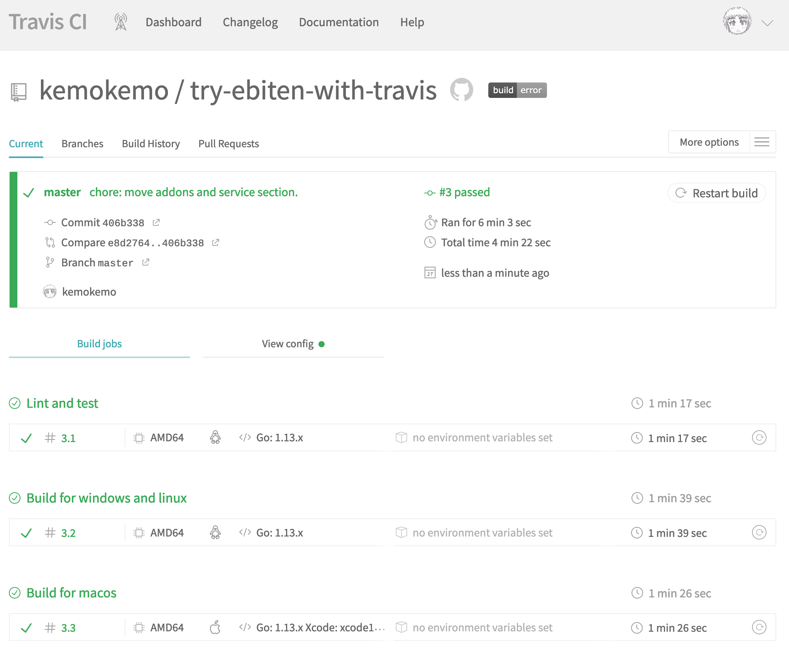

# try-ebiten-with-travis 

[ebiten](https://github.com/hajimehoshi/ebiten) を使ったゲームを [Travis CI](https://travis-ci.org/) で良い感じにクロスプラットフォームビルドするための練習 ʕ◔ϖ◔ʔ

## Travis CIでのビルド

[travis-ci.org/kemokemo/try-ebiten-with-travis](https://travis-ci.org/kemokemo/try-ebiten-with-travis)

このサンプルリポジトリで実践する`CI/CD`の内容は以下。

- `os=linux`で...
  - `golint`や`go vet`によるチェック
  - `go test -v -cover`によるテスト
  - `windows`および`linux`用バイナリのビルド
- `os=osx`で...
  - `macOS`用バイナリのビルド
- `tag`があれば、上記ビルドした全てのバイナリをGitHubのリリースページにアップ
